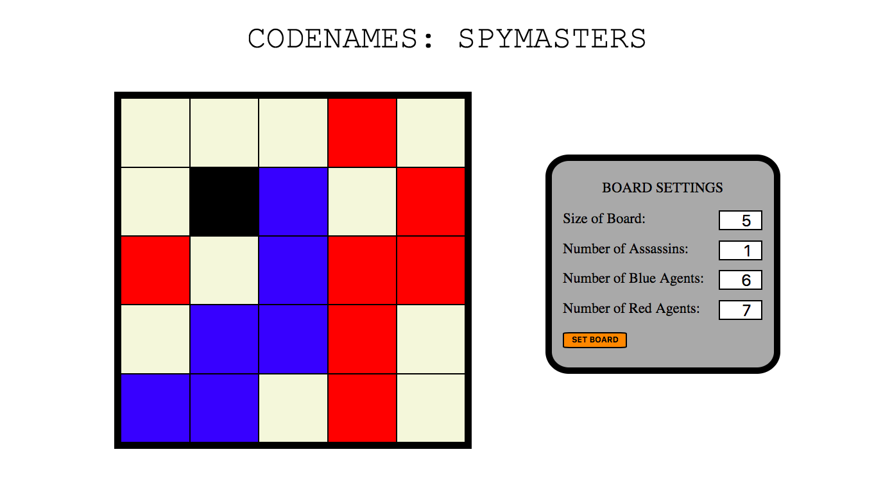
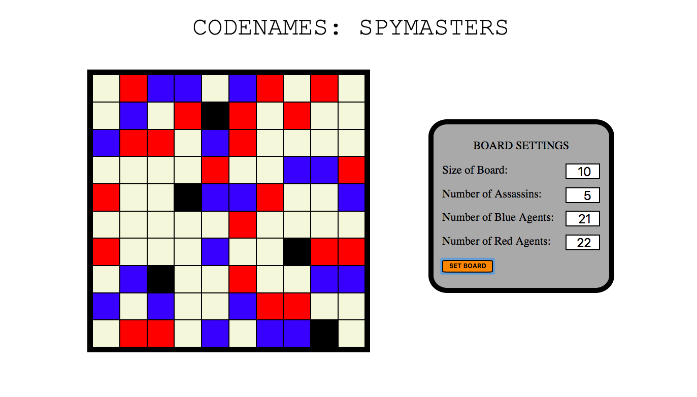
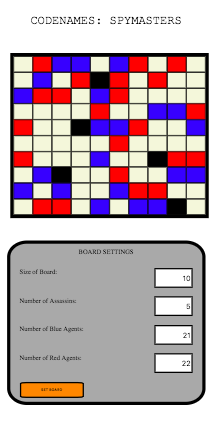

# Code Names Companion Grid

### Setup Instructions

> 1. Clone repo
>    - `git clone https://github.com/[Your Username]/Code-Names-Companion.git`
> 1. Change directory into the newly cloned repo
>    - `cd Code-Names-Companion`
> 1. Open in IDE and launch in browser

### Intended Usage

>  - This repo creates a more dynamic grid layout for the Codenames card game.  You will still need to buy the game in order to play

> - Page contains form so you can input your own size and numbers of agents and comes set with default values

